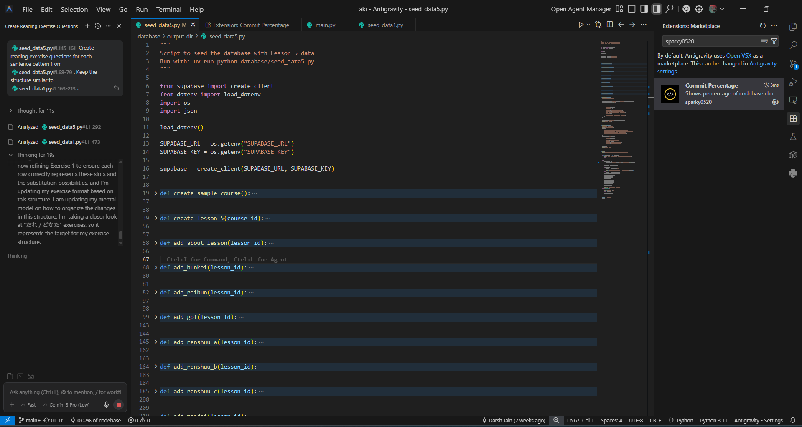
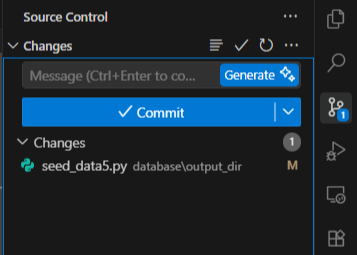
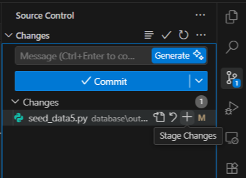
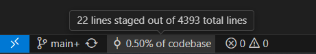

# Commit Percentage

### Know how much code AI changed while Vibe Coding

This extension will tell you the percentage changes (both deletion and additons combined) of your staged files compared to the total repository lines of code.

## Usage

Install the extension from the Antigravity Marketplace or Cursor Marketplace.

  1. Open a folder that is already initialized as a Git repository in VS Code or Cursor. Make some code changes in one or more tracked files.

  2. Open the Source Control view and click Stage All Changes (the + button) or stage individual files.

  3. Look at the status bar (bottom left): the extension shows what percentage of the entire repo’s codebase your currently staged changes represent (for example, 🔵 3.42% of codebase).

  4. Adjust which files are staged (stage/unstage) to see the percentage update in real time before committing.

The percentage is computed from staged changes only, so you do not need to commit to see it.

#### ⭐ Star the [Repository](https://github.com/sparky0520/commit-percentage)

#### ☕ Buy me a [coffee](https://www.buymeacoffee.com/sparky0520)